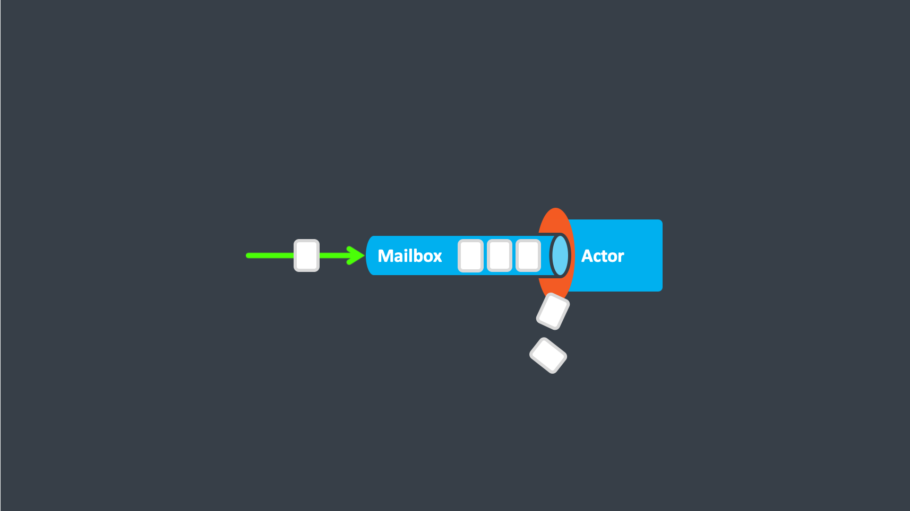

# Mailboxes

## Introduction
Each actor in Proto.Actor has a `Mailbox`, this is where the messages are enqueued before being processed by the actor.

## Concurrency

- Message posting can be done concurrently
- Message receive is done sequentially

By default an unbounded mailbox is used, this means any number of messages can be enqueued into the mailbox.

## Unbounded Mailbox

The unbounded mailbox is a convenient default but in a scenario where messages are added to the mailbox faster than the actor can process them, this can lead to the application running out of memory. For this reason a bounded mailbox can be specified, the bounded mailbox will pass new messages to deadletters when the mailbox is full.

## Bounded Mailbox

### Dropping Tail Mailbox

### Dropping Head Mailbox

## Instrumentation

### Dispatchers and invokers

The mailbox requires two handlers to be registered, a dispatcher and an invoker. When an actor is spawned, the invoker will be the actor context, and the dispatcher is taken from the Props.

##### Mailbox invoker

When the mailbox pops a message from the queue, it hands over the message to the registered invoker to handle the message. For an actor, the actor's context will get the message and invoke the actor's `Receive` method for processing. 

If an error occurs while the message is being processed, the mailbox will escalate the error to its registered invoker, so that it can take the appropriate action (e.g. restart the actor) and continue if possible.

Read more on the topic of supervision [Supervision](supervision.md)

##### Mailbox dispatchers

When the mailbox gets a message, it will schedule itself to process messages that are in the mailbox queues, using the dispatcher. 

The dispatcher is responsible for scheduling the processing to be run. 
The implementation of this varies by platform, e.g. in Go it is a simple invocation of a goroutine, whereas in C## the processing is handled by registering a Task to be run on the thread pool. 

The dispatcher is also responsible for limiting the throughput on each mailbox run. The mailbox will pick messages one by one in a single thread. By limiting the throughput of each run, the thread in use can be released so that other mailboxes can get scheduled to run.

### Statistics

Mailbox statistics allows the developer to listen to the following mailbox events:

- User messages
- System messages
- Started event
- Empty event