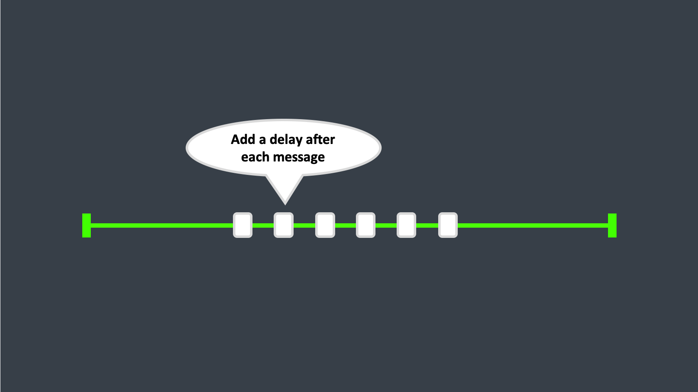
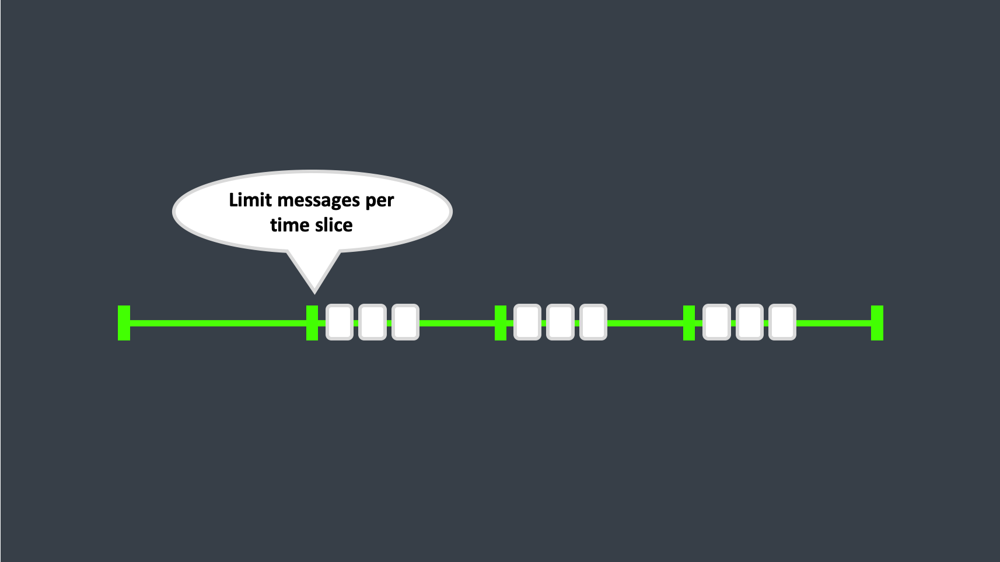

# Message Throttling

## Simple Throttling

In the most simple case, we can throttle message processing for an actor by adding a delay after each message processing.

Making the actor receive a message, handle it, wait for X time.
Then receive the next message if available.

This works, and might be enough for some scenarios.
But it would come with the drawback that every message send would cause a delay. 
Even if your actor only receives two messages for an hour, if you send those messages directly after eachother, the second message would still have to wait before being processed.

## Time Sliced Throttling

